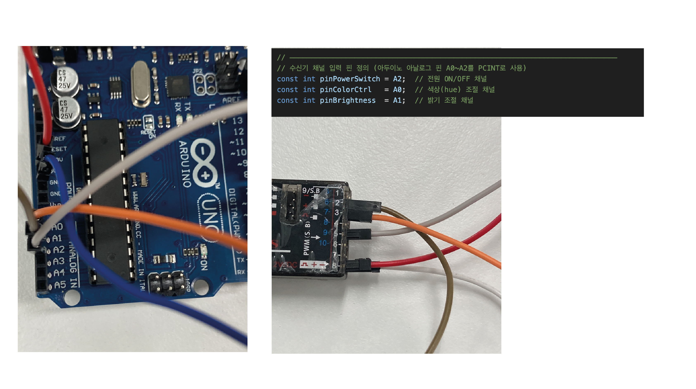
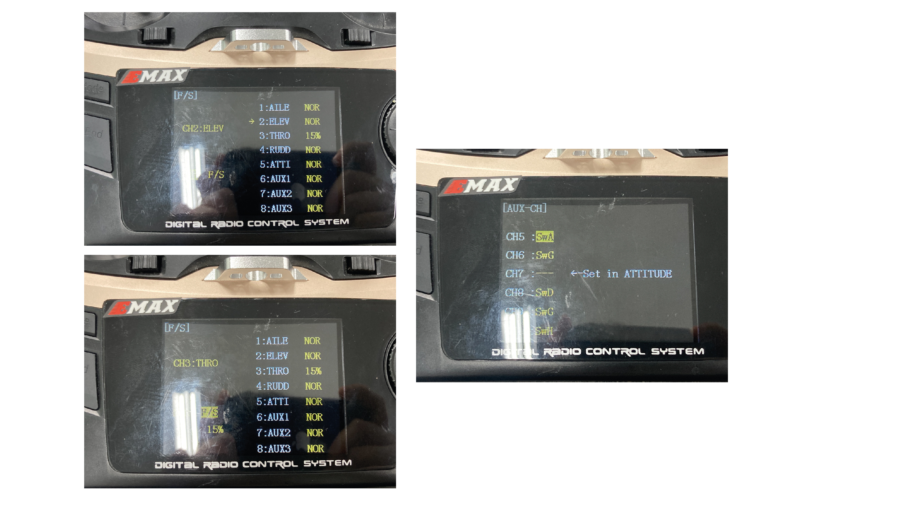
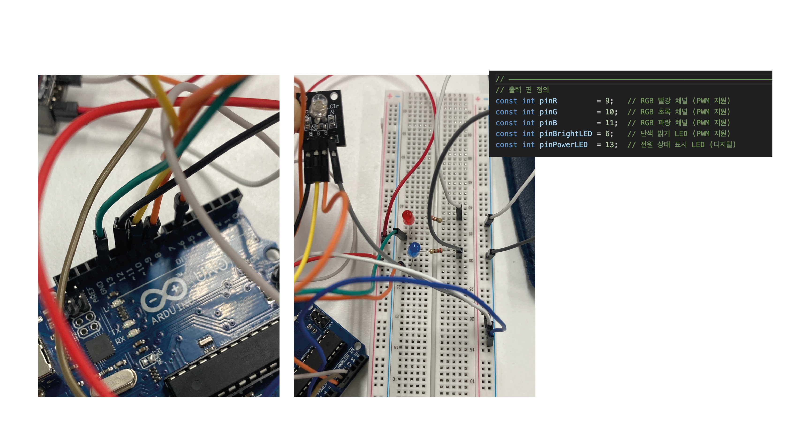

# 🎮 무선 수신기를 이용한 RGB 및 밝기 LED 제어 시스템

시연 영상: https://youtu.be/YdkOOg2AVu0

> 202001929 김채연  
> Arduino Uno + 수신기 + 송신기 + RGB LED + 단색 LED  
> 채널별 기능 분리 제어 프로젝트

---

## 📷 회로 구성 예시

### 🔌 아두이노 입력 및 출력 연결


- A0 → CH3 (색상 조절)
- A1 → CH2 (밝기 조절)
- A2 → CH5 (전원 스위치)


- CH3 = THRO → A0  
- CH2 = ELEV → A1  
- CH5 = SwA  → A2  


- D9, D10, D11 → RGB LED  
- D6 → 단색 LED (밝기 전용)  
- D13 → 전원 상태 표시 LED  

---

## 📋 기능 설명

- **CH5 (SwA 스위치)**  
  전원 상태 LED만 ON/OFF (D13)  
  다른 동작에는 영향을 주지 않음

- **CH3 (THRO 스틱)**  
  색상(Hue) 변경 → RGB LED 색상 전환  
  HSV 색상환 기반 3구간 분할 변환

- **CH2 (ELEV 스틱)**  
  밝기 조절 → 단색 LED(Pin 6)의 밝기 PWM 출력

- **모든 기능은 독립적으로 작동하며**, 수신기 입력 신호(PWM)를 `PinChangeInterrupt`로 처리

---

## 🔧 사용 부품 및 환경

- Arduino Uno
- Radiolink R9DS 수신기
- Radiolink AT9S 송신기
- RGB LED (공통 캐소드형)
- 단색 밝기 LED
- 220Ω 저항 × 4
- 점퍼선 / 브레드보드
- 라이브러리: [PinChangeInterrupt](https://github.com/NicoHood/PinChangeInterrupt)

---

## 💡 주요 코드 요약

- **`setup()`**
  - 입력 핀 설정  
    - `pinPowerSwitch (A2)`, `pinColorCtrl (A0)`, `pinBrightness (A1)` → `INPUT_PULLUP`  
    - 각 핀에 `attachPCINT(..., CHANGE)` 로 PCINT 인터럽트 연결
  - 출력 핀 설정  
    - `pinR (9)`, `pinG (10)`, `pinB (11)`, `pinBrightLED (6)`, `pinPowerLED (13)` → `OUTPUT`
  - 디버깅용 시리얼 통신  
    - `Serial.begin(9600)`

- **`loop()`**
  1. ISR에서 갱신된 PWM 펄스 폭을 로컬 변수에 복사  
     ```cpp
     int pwmPower  = powerPulseWidth;
     int pwmColor  = colorPulseWidth;
     int pwmBright = brightPulseWidth;
     ```
  2. 밝기 매핑 → 단색 LED 출력  
     ```cpp
     int brightness = map(pwmBright, 1000, 2000, 0, 255);
     brightness = constrain(brightness, 0, 255);
     analogWrite(pinBrightLED, brightness);
     ```
  3. 색상(hue) 매핑 → HSV→RGB 변환 → RGB LED 출력  
     ```cpp
     int hue = map(pwmColor, 1000, 2000, 0, 255);
     hue = constrain(hue, 0, 255);
     // 3구간 분할 방식으로 r/g/b 계산 후
     analogWrite(pinR, r);
     analogWrite(pinG, g);
     analogWrite(pinB, b);
     ```
  4. 전원 스위치 상태에 따른 LED 제어  
     ```cpp
     if (pwmPower < 1500) digitalWrite(pinPowerLED, LOW);
     else                   digitalWrite(pinPowerLED, HIGH);
     ```
  5. 디버깅 메시지 출력 (플래그 기반)  
     ```cpp
     if (newPowerPulse)  { Serial.println(pwmPower);  newPowerPulse = false; }
     if (newColorPulse)  { Serial.println(pwmColor);  newColorPulse = false; }
     if (newBrightPulse) { Serial.println(pwmBright); newBrightPulse = false; }
     ```

- **`isrPowerSwitch()` / `isrColorControl()` / `isrBrightness()`**
  1. **HIGH 엣지** → `micros()` 읽어서 `*_StartMicros` 저장  
  2. **LOW 엣지** → `micros() - *_StartMicros` 로 펄스 폭 계산  
  3. 계산된 값을 전역 변수(`*_PulseWidth`)에 저장하고 `new*Pulse = true` 설정  

---


